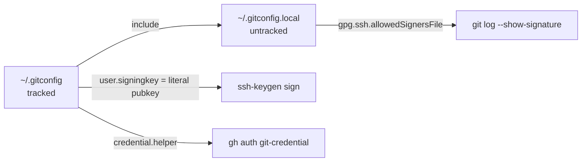

# Architecture overview

## What this is

A small set of configuration files, one per tool, installed into the home directory. There is no build step or package manager; the "deployment" is a handful of `ln -sfn` (macOS, wrapped in `install.sh`) or `Copy-Item` (Windows) commands documented in [Getting started](../getting-started.md) and [Windows setup](../guides/windows-setup.md).

## Layout

```
shell/
  .zshrc                              → ~/.zshrc                (macOS)
  starship.toml                       → ~/.config/starship.toml (both)
  Microsoft.PowerShell_profile.ps1    → $PROFILE                (Windows)
git/
  .gitconfig                          → ~/.gitconfig            (both)
  .gitconfig.windows                  → ~/.gitconfig.local      (Windows)
  .gitignore_global                   → ~/.gitignore_global     (both)
AGENTS.md                             guidelines for AI coding agents, not a dotfile
```

## Design decisions

The two load-bearing ones have ADRs: [0001 two-layer configuration](decisions/0001-two-layer-configuration.md) and [0002 symlinks vs copies](decisions/0002-symlinks-on-macos-copies-on-windows.md). Summary of all of them:

**Symlinks on macOS, copies on Windows.** Symlinks make `git pull` the update mechanism. Windows symlinks need elevated privileges or Developer Mode, so the docs use copies there.

**Two layers: tracked config + untracked local file.** Both `.zshrc` and `.gitconfig` end by loading `~/.zshrc.local` / `~/.gitconfig.local`. Secrets, absolute paths and host-specific keys (`allowedSignersFile`, Windows `ssh.exe` paths) go in the local file so the tracked file is identical on every machine. The signing key is stored as a literal public key for the same reason.

**Graceful degradation.** Every optional tool in `.zshrc` is guarded by `command -v`; plugins are guarded by `[ -f … ]`. A bare macOS with only zsh still gets a working shell. The `FZF_*_COMMAND` variables are only exported when `fd` exists because fzf disables its widgets if they are set to an empty string.

**Startup time.** Three deliberate choices: `compinit` does the full (slow) security scan at most once a day; nvm is lazy-loaded through wrapper functions that replace themselves on first use (~0.5 s saved per shell); Homebrew's `shellenv` lives in `~/.zprofile` (login shell) rather than `.zshrc`, so it runs once instead of per interactive shell.

**Load order matters at the end of `.zshrc`.** Plugins wrap ZLE widgets, so they load after `compinit`, fzf and zoxide; autosuggestions before syntax-highlighting; Starship last. `~/.zshrc.local` loads before the plugins.

**Starship without a Nerd Font.** `starship.toml` is the "no-nerd-font" preset reduced to the handful of symbol overrides needed, so the prompt renders with any monospace font.

**Global gitignore is narrow on purpose.** It lists OS and editor noise only. Build artifacts and logs are excluded per project so legitimately tracked files (e.g. `*.sql` migrations) are never silently hidden.

## Git identity and signing flow


