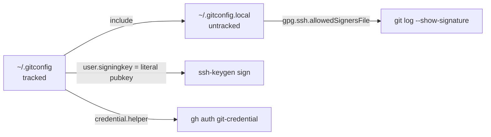

# Architecture overview

## What this is

The repository stores configuration files for zsh, PowerShell, Starship, and Git, plus global instructions for AI coding agents. It has no build step or package manager. [`install.sh`](../../install.sh) wraps the macOS `ln -sfn` commands, while the [Windows setup](../guides/windows-setup.md) uses `Copy-Item`. [Getting started](../getting-started.md) documents the macOS setup.

## Layout

```
shell/
  .zshrc                              → ~/.zshrc                (macOS)
  starship.toml                       → ~/.config/starship.toml (both)
  Microsoft.PowerShell_profile.ps1    → $PROFILE                (Windows)
git/
  .gitconfig                          → ~/.gitconfig            (both)
  .gitconfig.windows                  → ~/.gitconfig.local      (Windows)
  .gitignore_global                   → ~/.gitignore_global     (both)
agents/
  AGENTS.md                           → ~/.agents/AGENTS.md     (both)
                                      → ~/.claude/CLAUDE.md     (both)
tests/                                tests for install.sh and .zshrc, not dotfiles
AGENTS.md                             guidelines for agents working in this repo, not a dotfile
```

## Design decisions

Two decisions have ADRs: [0001 two-layer configuration](decisions/0001-two-layer-configuration.md) and [0002 symlinks versus copies](decisions/0002-symlinks-on-macos-copies-on-windows.md). The sections below summarize those ADRs and the remaining design choices.

**Symlinks on macOS, copies on Windows.** `git pull` updates symlinked files. Windows symlinks need elevated privileges or Developer Mode, so the docs use copies there.

**Tracked configuration with local overrides.** Both `.zshrc` and `.gitconfig` load an untracked local file. Secrets, absolute paths, and host-specific keys such as `allowedSignersFile` and Windows `ssh.exe` paths go in `~/.zshrc.local` or `~/.gitconfig.local`. The tracked file stays identical on every machine. `.gitconfig` stores the signing key as a literal public key for the same reason.

**Optional dependencies.** `.zshrc` checks for optional tools before it runs their setup code, and it checks for plugin files with `[ -f … ]`. The shell works on macOS without those tools. It exports the `FZF_*_COMMAND` variables only when `fd` exists because empty values disable the fzf widgets.

**Startup time.** `compinit` performs its security check, and looks for new completion functions, at most once a day. The completion dump is then compiled with `zcompile`, which cut startup by about a quarter (12 ms) in a Linux benchmark. The default Node version goes on `PATH` directly, and a wrapper function loads nvm itself on first use, which saves about 0.5 seconds per shell start. Homebrew's `shellenv` command runs from `~/.zprofile` once per login instead of from `.zshrc` for every interactive shell.

**Load order.** Plugins wrap ZLE widgets, so they load after `compinit`, fzf, and zoxide. Autosuggestions load before syntax highlighting, and Starship loads last. `~/.zshrc.local` loads before the plugins.

**Starship without a Nerd Font.** `starship.toml` contains five symbol overrides from the "no-nerd-font" preset, so the prompt renders with any monospace font.

**Global Git ignore rules.** The global ignore file lists only operating system and editor files. Each project excludes its own build artifacts and logs, which prevents the global file from hiding tracked files such as `*.sql` migrations.

**One instruction file for every agent.** `agents/AGENTS.md` is linked twice: to `~/.agents/AGENTS.md`, the shared agent directory that also holds installed skills, and to `~/.claude/CLAUDE.md`, because Claude Code reads only that name.

## Git identity and signing flow


```mermaid
flowchart LR
    A[~/.gitconfig<br/>tracked] -->|include| B[~/.gitconfig.local<br/>untracked]
    A -->|user.signingkey = literal pubkey| C[ssh-keygen sign]
    B -->|gpg.ssh.allowedSignersFile| D[git log --show-signature]
    A -->|credential.helper| E[gh auth git-credential]
```
